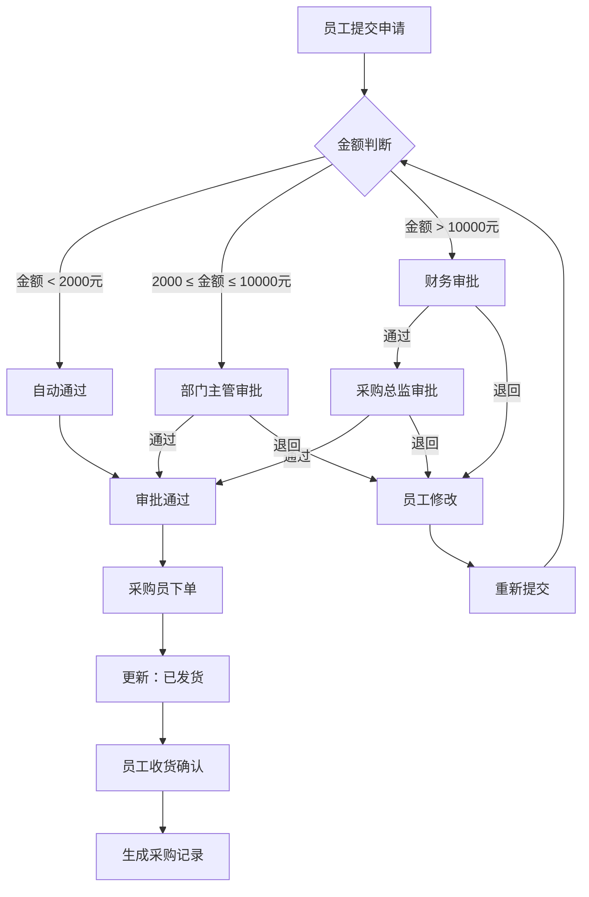

## 1. 产品概述

企业内部采购申请与审批流程管理系统，专注于内部采购申请的流转与审批，帮助企业规范采购流程、提高审批效率、掌握预算使用情况。

- 核心目标：实现采购申请的全流程数字化管理，包括申请提交、智能路由审批、状态跟踪、数据统计分析
- 目标用户：企业员工（申请人）、部门主管、财务人员、采购总监、采购员、系统管理员
- 产品价值：减少纸质审批、规范采购流程、提高透明度、辅助预算决策

## 2. 核心功能

### 2.1 用户角色

| 角色 | 说明 | 核心权限 |
|------|------|----------|
| 普通员工 | 各部门员工 | 提交采购申请、查看个人申请、收货确认 |
| 部门主管 | 各部门负责人 | 审批本部门申请（中额）、查看部门统计 |
| 财务审批人 | 财务部门人员 | 审批大额申请（财务环节）、查看财务统计 |
| 采购总监 | 采购部门负责人 | 审批大额申请（总监环节）、终审 |
| 采购员 | 执行采购的人员 | 处理已通过申请、下单、更新物流状态 |
| 管理员 | 系统管理员 | 用户管理、流程配置、全局统计 |

### 2.2 功能模块

1. **登录/角色切换**：用户登录、角色切换导航
2. **工作台首页**：待办事项、申请概览、快捷操作
3. **采购申请**：新建申请、编辑草稿、申请列表、详情查看
4. **审批中心**：待我审批、已审批、审批操作（通过/退回）
5. **采购执行**：已通过申请、下单处理、物流状态更新
6. **收货确认**：待收货列表、确认收货操作
7. **统计分析**：部门维度统计、金额分布、审批通过率、预算使用分析

### 2.3 页面详情

| 页面名称 | 模块名称 | 功能描述 |
|----------|----------|----------|
| 登录页 | 登录表单 | 账号密码登录、角色选择 |
| 工作台 | 数据看板 | 待办数量、状态分布图、最近申请列表、快捷入口 |
| 新建申请页 | 申请表单 | 物品名称、用途描述、类别选择、预算金额、期望到货日期、附件上传 |
| 我的申请列表 | 申请列表 | 按状态筛选、搜索、分页、查看详情、编辑草稿、撤回 |
| 申请详情页 | 详情展示 | 申请基本信息、审批进度时间线、操作按钮、审批意见记录 |
| 审批中心 | 待办列表 | 待审批申请、审批操作（通过/退回+意见）、已审批记录 |
| 采购执行 | 采购列表 | 已通过申请列表、下单操作、更新状态（已下单/已发货/已收货） |
| 收货确认 | 收货列表 | 待收货申请、确认收货操作、历史收货记录 |
| 统计分析 | 数据图表 | 部门申请频次柱状图、金额区间分布图、审批通过率折线图、预算使用热力图 |

## 3. 核心流程

### 3.1 采购申请主流程

员工登录系统后填写采购申请，系统根据金额和类别自动匹配审批流程。小额申请（<2000元）自动通过，中额申请（2000-10000元）由部门主管审批，大额申请（>10000元）需财务和总监联合审批。审批通过后进入采购环节，采购员下单并跟踪物流，申请人收货确认后完成流程。审批不通过可退回修改，申请人修改后重新提交。

### 3.2 审批流程规则

- **小额自动通过**：预算金额 < 2000元，无需人工审批，系统自动标记通过
- **中额部门审批**：2000元 ≤ 预算金额 ≤ 10000元，仅需本部门主管审批
- **大额联合审批**：预算金额 > 10000元，需先财务审批，通过后再由采购总监终审
- **退回机制**：任意审批节点可退回，需填写退回原因；申请人修改后重新走完整流程

## 4. 用户界面设计

### 4.1 设计风格

- **主色调**：深蓝 #1e3a8a（稳重、专业），配合宝蓝 #2563eb 作为强调色
- **辅助色**：成功绿 #10b981、警告橙 #f59e0b、危险红 #ef4444、信息青 #06b6d4
- **背景色**：浅灰渐变 #f8fafc → #f1f5f9，营造洁净专业的企业氛围
- **按钮风格**：微圆角（8px）、微妙阴影、hover时轻微上浮+阴影加深
- **字体选择**：正文使用"思源黑体/SOURCE HAN SANS"，标题使用"思源黑体 Bold"，数字使用等宽字体增强数据可读性
- **布局风格**：左侧固定导航栏 + 顶部用户栏 + 右侧内容区的经典企业后台布局；卡片式内容容器，统一边框和阴影
- **图标风格**：线性图标（Lucide风格），保持简洁统一，24px为主尺寸

### 4.2 页面设计概览

| 页面名称 | 模块名称 | UI元素 |
|----------|----------|--------|
| 登录页 | 登录卡片 | 居中卡片布局，左侧品牌区（Logo+Slogan+渐变背景），右侧表单区；输入框带前导图标；按钮带加载动效 |
| 工作台 | 数据卡片 | 4张统计卡片（待办/进行中/本月通过/本月金额）；2个图表区（状态饼图+趋势折线图）；最近申请表格 |
| 新建申请页 | 表单区 | 分组表单布局（基本信息/采购明细/补充说明）；标签式步骤指示；实时金额校验提示 |
| 申请详情页 | 时间线 | 左侧垂直时间线展示审批节点流转；右侧详情面板；操作按钮固定底部 |
| 审批中心 | 表格 | 数据表格+侧滑详情面板；批量操作栏；高级筛选抽屉 |
| 统计分析 | 图表区 | 2x2图表网格布局；每个图表带标题、单位说明、导出按钮；支持时间范围切换 |

### 4.3 响应式设计

- **桌面优先**：以1440px宽度为基准设计，适配1920px大屏
- **平板适配**：1024px时导航栏收起为图标模式，内容区自适应
- **移动端**：768px以下采用顶部Tab导航，卡片单列布局，表格转为卡片列表
- **触控优化**：移动端点击区域≥44x44px，表格横向滚动支持

### 4.4 动效与交互动效

- **页面进入**：内容区从下往上淡入（translateY 20px → 0，opacity 0→1，300ms ease-out）
- **卡片悬停**：轻微上移（translateY -2px），阴影加深，200ms过渡
- **审批流转**：时间线节点点亮动画，状态标签颜色渐变切换
- **数据图表**：图表首次加载时的数据渐进式渲染动画
- **反馈提示**：Toast通知从顶部滑入，操作成功的微动效
