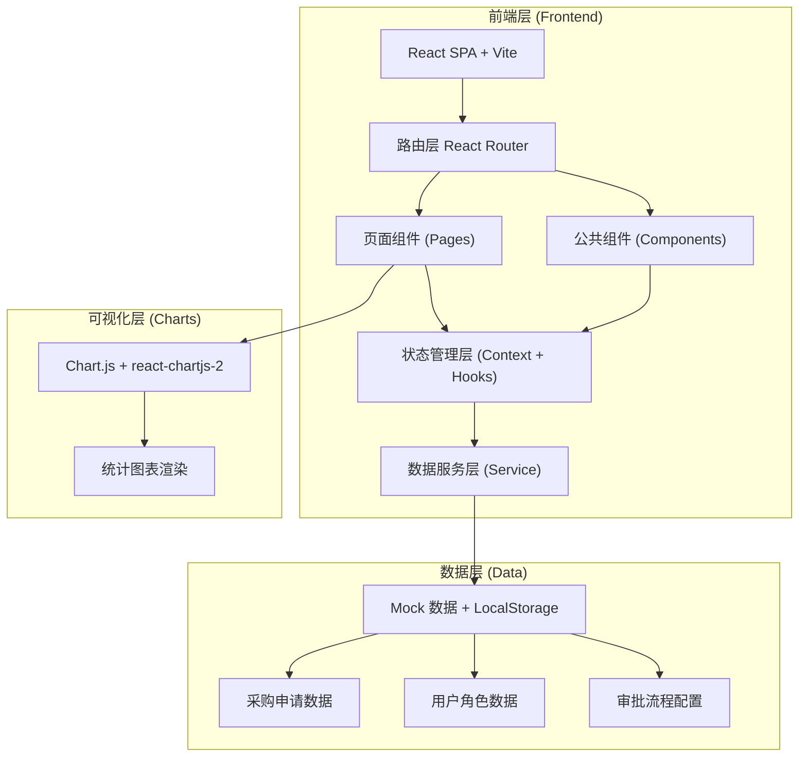

## 1. 架构设计

本系统采用单页应用（SPA）架构，前端使用React框架实现，数据持久化通过浏览器localStorage模拟后端存储，图表使用Chart.js实现可视化展示。



## 2. 技术描述

- **前端框架**：React@18（函数组件 + Hooks）
- **构建工具**：Vite@5（快速开发与构建）
- **样式方案**：TailwindCSS@3（原子化CSS）+ 自定义CSS变量
- **路由管理**：React Router v6（嵌套路由、动态路由）
- **状态管理**：React Context + useReducer（全局状态）+ localStorage（持久化）
- **UI图标**：Lucide React（线性图标库）
- **图表库**：Chart.js@4 + react-chartjs-2（数据可视化）
- **表单处理**：React 原生表单 + 自定义校验
- **日期处理**：原生Date API + 格式化工具函数
- **数据持久化**：localStorage（模拟后端数据库）
- **后端服务**：无（纯前端实现，Mock数据驱动）

## 3. 路由定义

| 路由路径 | 页面组件 | 用途说明 | 访问角色 |
|----------|----------|----------|----------|
| `/login` | LoginPage | 用户登录页 | 所有（未登录） |
| `/dashboard` | DashboardPage | 工作台首页 | 所有已登录用户 |
| `/purchase/new` | NewPurchasePage | 新建采购申请 | 普通员工、管理员 |
| `/purchase/list` | PurchaseListPage | 我的申请列表 | 普通员工、管理员 |
| `/purchase/:id` | PurchaseDetailPage | 申请详情页 | 所有已登录用户 |
| `/approval` | ApprovalCenterPage | 审批中心（待办/已办） | 部门主管、财务、采购总监 |
| `/procurement` | ProcurementPage | 采购执行（下单/物流） | 采购员、管理员 |
| `/receipt` | ReceiptPage | 收货确认 | 普通员工（申请人） |
| `/statistics` | StatisticsPage | 统计分析仪表盘 | 部门主管、财务、管理员 |

## 4. 数据模型与类型定义

```typescript
// 用户角色枚举
type UserRole = 'employee' | 'manager' | 'finance' | 'director' | 'buyer' | 'admin';

// 用户接口
interface User {
  id: string;
  name: string;
  account: string;
  password: string;
  role: UserRole;
  department: string;
  email: string;
  avatar?: string;
}

// 采购物品类别
type PurchaseCategory = 
  | 'office'      // 办公用品
  | 'it'          // IT设备
  | 'furniture'   // 办公家具
  | 'marketing'   // 市场物料
  | 'training'    // 培训教育
  | 'other';      // 其他

// 申请状态枚举
type PurchaseStatus = 
  | 'draft'        // 草稿
  | 'pending'      // 待审批（自动匹配流程后）
  | 'auto_approved' // 自动通过（小额）
  | 'manager_pending'   // 待部门主管审批
  | 'finance_pending'   // 待财务审批
  | 'director_pending'  // 待采购总监审批
  | 'rejected'     // 已退回/拒绝
  | 'approved'     // 审批通过（待采购）
  | 'ordered'      // 已下单
  | 'shipped'      // 已发货
  | 'received'     // 已收货（流程完成）
  | 'cancelled';   // 已撤回

// 审批记录
interface ApprovalRecord {
  id: string;
  purchaseId: string;
  approverId: string;
  approverName: string;
  approverRole: UserRole;
  action: 'approve' | 'reject' | 'auto';
  comment?: string;
  createdAt: string;
}

// 采购记录
interface PurchaseOrder {
  id: string;                    // 申请单号（自动生成：PO-YYYYMMDD-XXXX）
  title: string;                 // 申请标题/物品名称
  category: PurchaseCategory;    // 物品类别
  purpose: string;               // 用途说明
  budget: number;                // 预算金额（元）
  quantity: number;              // 数量
  unit: string;                  // 单位
  expectedDate: string;          // 期望到货日期
  applicantId: string;           // 申请人ID
  applicantName: string;         // 申请人姓名
  department: string;            // 申请部门
  attachments?: string[];        // 附件（文件名）
  status: PurchaseStatus;        // 当前状态
  currentApprover?: UserRole;    // 当前审批人角色
  supplierName?: string;         // 供应商名称（采购员填写）
  orderDate?: string;            // 下单日期
  shipDate?: string;             // 发货日期
  receiptDate?: string;          // 收货日期
  receiptConfirmedBy?: string;   // 收货人
  approvalRecords: ApprovalRecord[];  // 审批历史
  createdAt: string;             // 创建时间
  updatedAt: string;             // 更新时间
}

// 统计数据结构
interface StatisticsData {
  byDepartment: { department: string; count: number; amount: number }[];
  byAmountRange: { range: string; count: number; total: number }[];
  approvalRate: { date: string; submitted: number; approved: number; rate: number }[];
  budgetUsage: { department: string; budget: number; used: number; rate: number }[];
}
```

## 5. 核心模块划分

```
src/
├── assets/              # 静态资源
│   └── styles/          # 全局样式、Tailwind入口
├── components/          # 公共组件
│   ├── Layout/          # 布局组件（侧边栏、顶栏）
│   ├── Card/            # 卡片组件
│   ├── StatusBadge/     # 状态标签组件
│   ├── Timeline/        # 审批时间线
│   ├── Toast/           # 消息提示
│   ├── Modal/           # 弹窗组件
│   ├── EmptyState/      # 空状态
│   └── ...
├── pages/               # 页面组件
│   ├── LoginPage/
│   ├── DashboardPage/
│   ├── NewPurchasePage/
│   ├── PurchaseListPage/
│   ├── PurchaseDetailPage/
│   ├── ApprovalCenterPage/
│   ├── ProcurementPage/
│   ├── ReceiptPage/
│   └── StatisticsPage/
├── context/             # 全局状态管理
│   ├── AuthContext.tsx  # 用户认证状态
│   └── PurchaseContext.tsx  # 采购申请状态
├── hooks/               # 自定义Hooks
│   ├── useAuth.ts
│   ├── usePurchase.ts
│   └── useStatistics.ts
├── services/            # 数据服务层
│   ├── authService.ts   # 认证服务
│   ├── purchaseService.ts  # 采购申请服务
│   └── statisticsService.ts # 统计服务
├── data/                # Mock数据
│   ├── mockUsers.ts     # 模拟用户数据
│   └── mockPurchases.ts # 模拟采购数据
├── utils/               # 工具函数
│   ├── constants.ts     # 常量定义（金额阈值、状态映射等）
│   ├── helpers.ts       # 通用工具（日期格式化、ID生成等）
│   ├── workflow.ts      # 审批流程路由逻辑
│   └── storage.ts       # localStorage操作封装
├── types/               # TypeScript类型定义
│   └── index.ts
├── App.tsx              # 根组件（路由配置）
└── main.tsx             # 入口文件
```

## 6. 审批流程引擎设计

### 6.1 金额阈值配置

| 阈值名称 | 下限(元) | 上限(元) | 审批流程 |
|----------|----------|----------|----------|
| 小额 | 0 | 2000 | AUTO → 自动通过 |
| 中额 | 2000 | 10000 | 部门主管审批 → 通过 |
| 大额 | 10000 | ∞ | 财务审批 → 采购总监审批 → 通过 |

### 6.2 流程路由函数

```typescript
// 根据金额计算下一审批节点
function getNextApprovalNode(budget: number): PurchaseStatus {
  if (budget < 2000) return 'auto_approved';
  if (budget <= 10000) return 'manager_pending';
  return 'finance_pending';
}

// 获取当前审批人的角色
function getApproverRoleForStatus(status: PurchaseStatus): UserRole | null {
  switch (status) {
    case 'manager_pending': return 'manager';
    case 'finance_pending': return 'finance';
    case 'director_pending': return 'director';
    default: return null;
  }
}

// 审批通过后的流转
function handleApproveTransition(currentStatus: PurchaseStatus): PurchaseStatus {
  switch (currentStatus) {
    case 'manager_pending': return 'approved';
    case 'finance_pending': return 'director_pending';
    case 'director_pending': return 'approved';
    default: return currentStatus;
  }
}
```

## 7. 初始化Mock数据

### 7.1 测试用户账号

| 账号 | 密码 | 角色 | 部门 |
|------|------|------|------|
| employee01 | 123456 | 普通员工 | 技术部 |
| employee02 | 123456 | 普通员工 | 市场部 |
| manager01 | 123456 | 部门主管 | 技术部 |
| manager02 | 123456 | 部门主管 | 市场部 |
| finance01 | 123456 | 财务审批人 | 财务部 |
| director01 | 123456 | 采购总监 | 采购部 |
| buyer01 | 123456 | 采购员 | 采购部 |
| admin01 | 123456 | 管理员 | 行政部 |

### 7.2 初始采购申请数据

预置15-20条覆盖各状态的模拟申请数据，用于演示各页面功能和统计图表。
